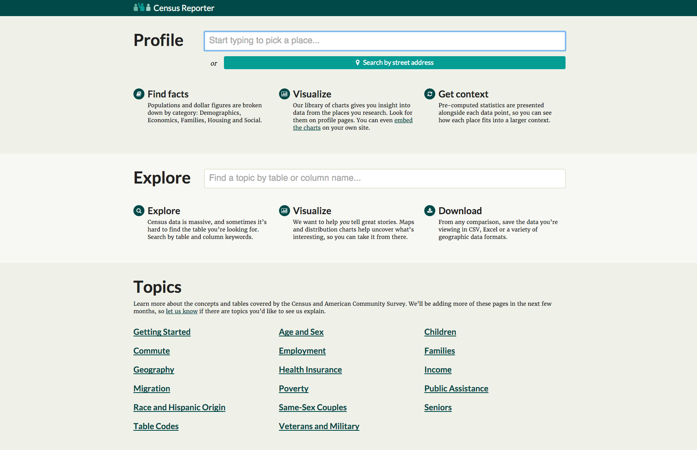
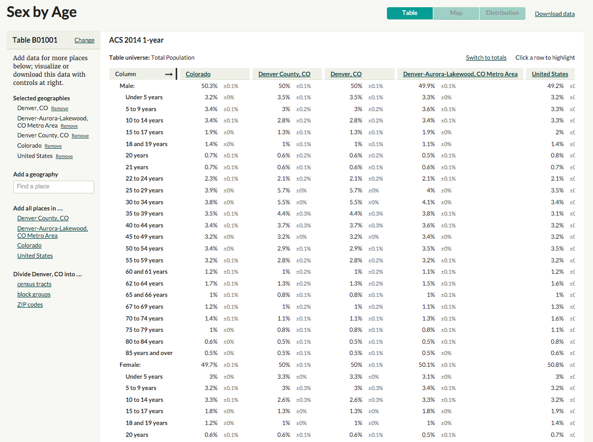
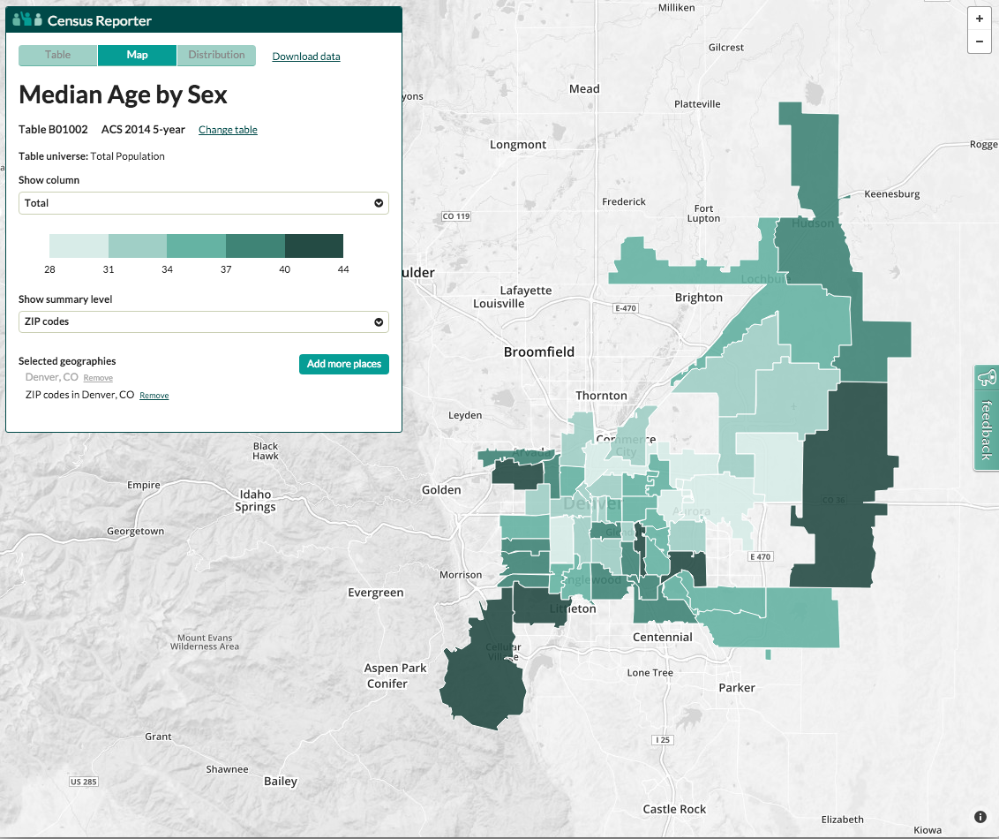
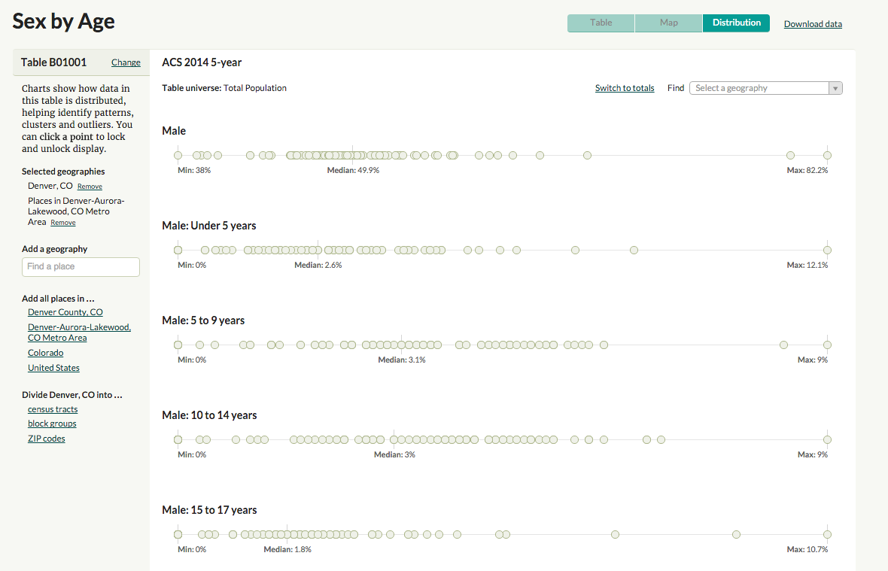
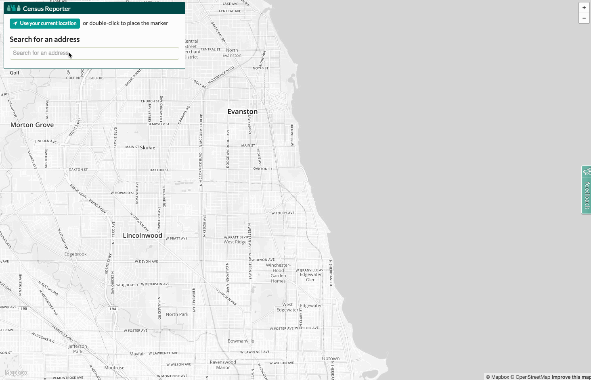

# [CensusReporter.org](http://censusreporter.org)

*By Brent Jones, for NICAR 2016*

First stop for exploring U.S. Census and American Community Survey data.
Can give you basic facts about a place very quickly.
Or be a starting place for a deeper story.

## Ways to explore:

* By place search
* By topic search
* Guided topics

## Guided Topics
Found on the homepage, these topics explain Census and ACS tables and provide direct links to CensusReporter summaries for many tables.

* [Getting Started](http://censusreporter.org/topics/getting-started/)
* [Table Codes](http://censusreporter.org/topics/table-codes/)
* [Geography](http://censusreporter.org/topics/geography/)

These three are an introduction to the rest. Getting Started is a basic overview of the data. Table Codes serves as sort of codebook for deciphering what the codenumbers mean. Geography explains how the Census breaks down and denotes geography within tables.

* [Age and Sex](http://censusreporter.org/topics/age-sex/)
* [Children](http://censusreporter.org/topics/children/)
* [Commute](http://censusreporter.org/topics/commute/)
* [Employment](http://censusreporter.org/topics/employment/)
* [Families](http://censusreporter.org/topics/families/)
* [Health Insurance](http://censusreporter.org/topics/health-insurance/)
* [Income](http://censusreporter.org/topics/income/)
* [Migration](http://censusreporter.org/topics/migration/)
* [Poverty](http://censusreporter.org/topics/poverty/)
* [Public Assistance](http://censusreporter.org/topics/public-assistance/)
* [Race and Hispanic Origin](http://censusreporter.org/topics/race-hispanic/)
* [Same-sex Couples](http://censusreporter.org/topics/same-sex/)
* [Seniors](http://censusreporter.org/topics/seniors/)
* [Veterans and Military](http://censusreporter.org/topics/veterans/)

The rest of these describe the topics in more detail as well as list many tables that pertain to the topic. They're a great way to get started if you're just exploring data.

## Topic Search

Also available from the homepage is topic search. You can start typing words relating to tables that you're interested in, and a dropdown list will show you what's available.

### What you get

With either of these methods, you'll get a page describing the table. Helpfully, you'll get the universe of the table, to see who is included in the data. You'll also see the columns available. Off to the right are links to the topic pages that are relevant.

Most importantly, at the top is a box to pick the geographies you want to look at. You can either type a place name or a "summary level" — meaning a type of geography, like state, county, place, etc.

If you choose a summary level you'll also be asked to choose another, larger, summary level to filter the first choice by. An example: If you choose "places", you can then filter to choose places *in* Missouri, or places *in* St. Louis County.

#### The table view

Once you've chosen your places and clicked through, you'll get a table. Here's its anatomy:

* At the top, you have the dataset used (usually ACS, with 1-, 3- or 5-year noted)
* Below that, the table universe.
* Across the top of the table, in columns, you have the geographies you selected.
* Down the sides, you have the "columns" of categories in the table.
* The data, with margins of error, are in the appropriate spots.

A few tools are available to you on this page. On the left you can change what geographies you're looking at. At the top right, you can download the data into various formats, including GeoJSON or shapefiles.

Finally, in the green buttons near the top, you can view the data in two other ways: A map or a distribution.

#### Map view

If you check out the map view, you'll see a choropleth map of the geography selected. Rolling over the geographies triggers a tooltip with the information selected, as well as the margin of error. An info box gives you the same basic data as the table view.

You want to be careful here, making sure that the column selected under "Show Column" in the info box is the column you think it is.

You can also change how your geography is divided, or change which geography you're looking at by clicking the Add More Places button.

#### Distribution view

The distribution view is the final way to view the data. I found out that internally, some folks at Census Reporter call these "COAL" charts, for "circles-on-a-line".

You'll find the familiar bar at the left with options for changing the geography, and the data set used as well as the universe at the top.

For each column, there's a line with each geography represented as a circle. The Minimum, Median and Maximum are labeled. Rolling over the circles generates the tooltip, and you can click to lock the tooltip open, in order to compare more than one item.

## Place search

One simple way of using Census Reporter is by finding out information about a specific place. You can do this in the top search bar on the homepage, or the search bar in the top toolbar on most pages.

You can also click on the "search by address" button and let the site have access to your location (or just type in an address). This method lets you choose any of the geographies your address fits into: from block group to state, division or region.

Once you've chosen a place, you'll see a map at the top of the page showing the boundaries of the area. There's an info box with basic information about the place. Also important, the info box tells which data set is used.

Below that, there's a box to jump to a specific table.

After that is a series of charts:

* Demographics
* Economics
* Families
* Housing
* Social

The charts note where the margins of error are large (and therefore where you should be careful using the data). You can roll over most areas on the charts to show more information.

The charts each have two links under them: Show data, and Embed.

### Show data

If you click "Show data" under any of the charts, a table pops open where you can see the numbers used in generating the charts, along with all the margins of error, and a dagger where the MOE is large. Another benefit of this chart is, if you have a small geography selected, it'll compare the selected geography with larger geographies, to give some context.